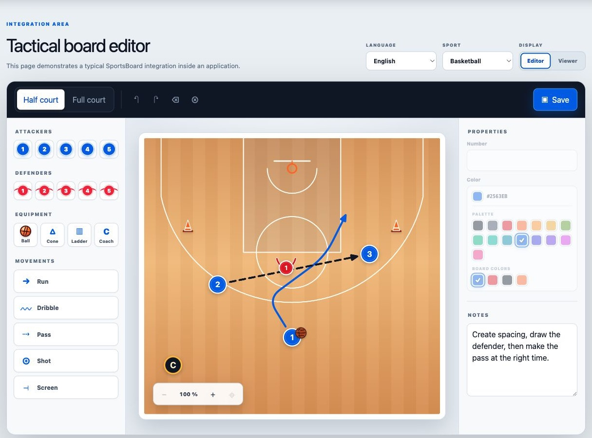
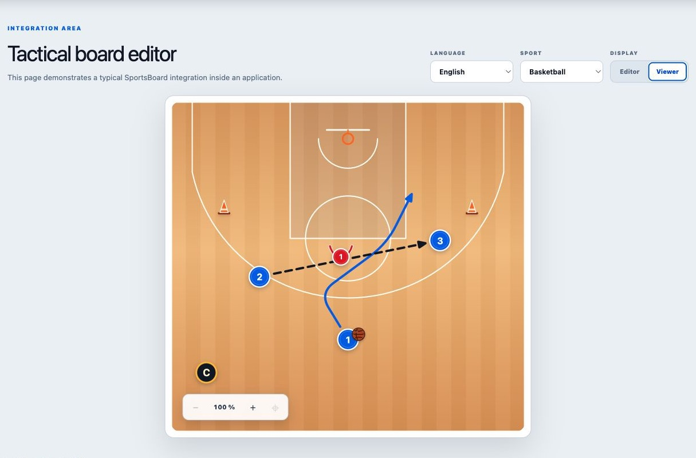

# SportsBoard

[](https://github.com/JacobDelcroix/sportsboard/actions/workflows/ci.yml)
[](https://www.npmjs.com/package/@jacobdelcroix/sportsboard)
[](LICENSE)

SportsBoard adds a complete sports tactic editor or a read-only board to a web page with one JavaScript import and one HTML element. Your application receives a portable JSON document and can also export PNG, JPEG, or WebP images.

Basketball and football are included. Each sport provides half and full surfaces with usable space outside the boundary lines, its own players and ball, and suitable movement tools.

## Why SportsBoard

- Complete visual editor and lightweight read-only viewer from the same JSON document.
- One declarative custom element for the common integration; focused JavaScript APIs remain available for advanced applications.
- Responsive mouse, keyboard, touch, tablet, and mobile interactions.
- Portable normalized coordinates, validated references, deterministic layers, undo/redo, notes, and image export.
- Basketball and football included, with extensible sports, elements, surfaces, colors, and translations.
- No framework or Tailwind runtime requirement. The package uses native web components and Konva.

<p align="center">
  
</p>

## Installation

```bash
npm install @jacobdelcroix/sportsboard
```

Import the custom elements once in your main application bundle:

```js
// resources/js/app.js, src/main.js, or your equivalent entry point
import '@jacobdelcroix/sportsboard/element';
```

This registers `<sports-board-editor>` and `<sports-board-viewer>` for every page that loads the bundle. Internal interface styles are included automatically; Tailwind CSS is not required by the library.

SportsBoard is an ESM package. Applications and contributors need Node.js 20 or newer; Laravel's Vite setup works without additional configuration. The editor targets modern browsers with custom elements, Canvas, `ResizeObserver`, and `structuredClone`. Form-associated custom-element support is required only for automatic native form submission; events and imperative reads work independently.

Focused entry points are available when bundle size matters:

| Import | Registers or exposes |
| --- | --- |
| `@jacobdelcroix/sportsboard/element` | Editor and viewer custom elements |
| `@jacobdelcroix/sportsboard/editor/element` | Editor plus its internal viewer |
| `@jacobdelcroix/sportsboard/viewer/element` | Viewer custom element only |
| `@jacobdelcroix/sportsboard/editor` | Imperative editor class |
| `@jacobdelcroix/sportsboard/viewer` | Imperative viewer and thumbnail APIs |
| `@jacobdelcroix/sportsboard/core` | Low-level document, registry, and canvas APIs |

## Supported sports

Use the exact value from the `sport` column on either custom element.

| Sport | `sport` value | Default surface | Other surface |
| --- | --- | --- | --- |
| Basketball | `basketball` | `basketball.halfcourt` | `basketball.fullcourt` |
| Football | `football` | `football.halfpitch` | `football.fullpitch` |

```html
<sports-board-editor sport="basketball"></sports-board-editor>
<sports-board-viewer sport="football"></sports-board-viewer>
```

The surface is normally read from `data.surface.type` in the JSON document. The default surface above is used only when no document is supplied. The optional `surface` attribute can force the initial surface of a new empty document.

## Supported languages

Use the exact value from the `locale` column. The locale applies to the editor, viewer controls, sport labels, surfaces, equipment, and movements.

| Language | `locale` value |
| --- | --- |
| English | `en` |
| French | `fr` |

```html
<sports-board-editor sport="basketball" locale="fr"></sports-board-editor>
<sports-board-viewer sport="football" locale="en"></sports-board-viewer>
```

English is used when `locale` is omitted. Translation catalogs can be overridden by the application, and new built-in languages can be contributed.

## Display the editor

Give the editor a parent with the space it should use, then add the element:

```html
<div class="board-container">
  <sports-board-editor
    sport="basketball"
    locale="en"
    class="my-editor"
  ></sports-board-editor>
</div>
```

```css
.board-container {
  width: 100%;
  height: 760px;
}
```

The custom element always uses `width: 100%` and `height: 100%`. The surrounding application therefore controls its placement and available space. The editor and viewer preserve the sport-specific field ratio while fitting both the available width and height. Tool and property panels scroll independently when their content is taller than the editor container. SportsBoard does not use Shadow DOM, so normal application classes and Tailwind utilities work on the element:

```html
<sports-board-editor
  sport="football"
  locale="fr"
  class="h-[760px] w-full overflow-hidden rounded-2xl"
></sports-board-editor>
```

One editor instance owns one sport. The application chooses the sport when it renders the element; coaches do not see a sport selector inside the editor.

### Tablet, mobile, and keyboard use

The editor adapts to the width of its own container. On compact layouts, coaches switch between **Tools**, **Board**, and **Inspector** using the bottom navigation. Tapping a tool adds it at the center and returns to the board; desktop users can also drag tools directly onto the field. Double-click or double-tap an element or movement to open its editable properties. Touch gestures support element movement, pinch zoom, and panning an empty area while zoomed. On desktop, the wheel scrolls the surrounding page normally; hold `Cmd` or `Ctrl` while using it to zoom the board.

The **Notes** button opens a dedicated writing drawer instead of using the narrow element inspector. It becomes a full-width sheet on compact layouts, saves while the coach types, and shows an indicator when the document contains notes.

Every sport editor also includes shared annotations and training equipment: resizable transparent colored zones, multiline free text, free letter/number markers, hurdles, and poles. Hurdles and poles appear alongside the sport's other equipment. Select text or a movement to edit its wording in the Inspector. Run, dribble, and pass movements can be converted into one another without redrawing their route or losing their attachments.

The **?** button inside the editor opens the built-in interaction guide. These shortcuts are available whenever focus is inside the editor and not inside a form field:

| Action | Shortcut |
| --- | --- |
| Copy selection | `Ctrl/Cmd + C` |
| Paste copy | `Ctrl/Cmd + V` |
| Cut selection | `Ctrl/Cmd + X` |
| Delete selection | `Delete` or `Backspace` |
| Undo | `Ctrl/Cmd + Z` |
| Redo | `Ctrl/Cmd + Shift + Z` or `Ctrl/Cmd + Y` |
| Deselect | `Escape` |
| Open help | `?` |
| Zoom with the wheel | `Cmd/Ctrl + wheel` |

The editor supports containers down to `480px` high. For the most comfortable touch workflow, give a phone editor the visible viewport height when possible:

```css
.board-container {
  height: max(620px, 100dvh);
}
```

## Load an existing diagram

Pass the saved JSON directly through the `data` attribute:

```html
<sports-board-editor
  id="exercise-diagram"
  sport="basketball"
  locale="fr"
  data='{"schema":"sportsboard","version":1,"surface":{"type":"basketball.halfcourt"},"elements":[]}'
></sports-board-editor>
```

Server-rendered applications can place their escaped JSON in the same attribute:

```blade
<sports-board-editor
    sport="basketball"
    locale="fr"
    data="{{ $diagram }}"
></sports-board-editor>
```

If no document is supplied, SportsBoard creates an empty diagram using the sport's default surface.

For dynamic loading, focused imports, embedded JSON, or imperative classes, see [Alternative integration methods](docs/alternative-integrations.md).

## Save JSON from the editor

Listen directly on the element. `change` is emitted after every content change; `save` is emitted by the editor's Save button.

```js
const editor = document.querySelector('sports-board-editor');

editor.addEventListener('change', (event) => {
  const { document, json } = event.detail;
  console.log(document);
  localStorage.setItem('exercise-diagram', json);
});

editor.addEventListener('save', async (event) => {
  await fetch('/api/exercises/42/diagram', {
    method: 'PUT',
    headers: { 'Content-Type': 'application/json' },
    body: event.detail.json
  });
});
```

You can also read the current value at any time:

```js
const document = editor.getDocument();
const json = editor.toJSON();
const readableJson = editor.toJSON(true);
```

### Use it in a normal HTML form

`<sports-board-editor>` is form-associated. Add `name` and its current JSON is submitted like a normal field; no hidden input is required.

```html
<form id="exercise-form" method="post" action="/exercises/42">
  <div style="height: 760px">
    <sports-board-editor
      id="exercise-board"
      name="diagram"
      sport="basketball"
      locale="fr"
      data='{"schema":"sportsboard","version":1,"surface":{"type":"basketball.halfcourt"},"elements":[]}'
    ></sports-board-editor>
  </div>

  <button type="submit">Save exercise</button>
</form>
```

The editor's built-in Save button emits `save`; it does not decide how the surrounding application submits. Connect it to the form when both Save buttons should use the same submission flow:

```js
const form = document.querySelector('#exercise-form');
const editor = document.querySelector('#exercise-board');

editor.addEventListener('save', () => form.requestSubmit());
```

On a normal browser submission, the request contains a `diagram` field holding the current JSON.

## Display the viewer

The viewer renders only the diagram. It cannot modify the document.

```html
<div class="board-container">
  <sports-board-viewer
    id="saved-diagram"
    sport="basketball"
    locale="en"
    controls
    data='{"schema":"sportsboard","version":1,"surface":{"type":"basketball.halfcourt"},"elements":[]}'
    class="w-full h-full"
  ></sports-board-viewer>
</div>
```

The editor internally composes this same viewer element in editable mode. Field rendering, zoom, pan, JSON loading, and image output therefore use one shared canvas implementation.

For a compact image-like preview, disable both controls and interactions:

```html
<sports-board-viewer
  sport="football"
  controls="false"
  interactive="false"
></sports-board-viewer>
```

<p align="center">
  
</p>

## Submit JSON and a thumbnail together

Intercept the form when the server should receive both the JSON and an image in the same request:

```js
const form = document.querySelector('#exercise-form');
const editor = document.querySelector('#exercise-board');
const submitButton = form.querySelector('[type="submit"]');

form.addEventListener('submit', async (event) => {
  event.preventDefault();
  submitButton.disabled = true;

  try {
    const thumbnail = await editor.toBlob({
      width: 640,
      type: 'image/webp',
      quality: 0.85
    });

    const body = new FormData(form);
    body.set('diagram', editor.toJSON());
    body.set('thumbnail', thumbnail, 'diagram.webp');

    const response = await fetch(form.action, {
      method: form.method,
      body
    });

    if (!response.ok) throw new Error(`Save failed (${response.status})`);
  } finally {
    submitButton.disabled = false;
  }
});
```

`toBlob()` exports only the field and its elements, without the editor interface, selection handles, or zoom controls.

For exercise lists, generate and store the thumbnail when a diagram is saved. Display the stored URL with a normal `` instead of mounting a canvas for every list item.

When no editor or viewer is mounted, use the offscreen thumbnail helper:

```js
import { renderSportsBoardThumbnail } from '@jacobdelcroix/sportsboard/viewer';
import { createBasketballViewer } from '@jacobdelcroix/sportsboard/basketball/viewer';

const thumbnail = await renderSportsBoardThumbnail({
  data: savedDiagramJson,
  sport: createBasketballViewer('en'),
  width: 640,
  type: 'image/webp',
  quality: 0.85
});
```

See [Saving diagrams and generating thumbnails](docs/saving-and-thumbnails.md) for complete native form, asynchronous upload, preview, Laravel, and multi-diagram examples.

## Events

Events bubble from the custom element, so they can be handled directly or through event delegation.

| Event | Element | `event.detail` |
| --- | --- | --- |
| `ready` | both | `{ document, mode, sport }` |
| `change` | editor | `{ document, json }` |
| `save` | editor | `{ document, json }` |
| `status` | editor | `{ message, tone }` |
| `viewportchange` | both | `{ zoom, pan }` |
| `error` | both | `{ error }` |

```js
document.querySelector('sports-board-editor')
  .addEventListener('error', (event) => console.error(event.detail.error));
```

## Laravel and Livewire

Load the library once from the normal application entry:

```js
// resources/js/app.js
import '@jacobdelcroix/sportsboard/element';
```

```blade
<head>
    @vite('resources/js/app.js')
</head>
```

The Blade or Livewire component can then use the registered HTML element without importing the package again:

```blade
<div wire:ignore style="height: 760px">
    <sports-board-editor
        data-exercise-board
        sport="basketball"
        locale="fr"
        data="{{ $diagram }}"
    ></sports-board-editor>
</div>

@script
<script>
    const editor = $wire.$el.querySelector('[data-exercise-board]');
    editor.addEventListener('change', (event) => {
        $wire.$set('diagram', event.detail.json);
    });

    editor.addEventListener('save', (event) => {
        $wire.$set('diagram', event.detail.json);
        $wire.save();
    });
</script>
@endscript
```

`wire:ignore` prevents Livewire from replacing Konva-managed DOM. With `wire:navigate`, component scripts or the `livewire:navigated` event should initialize page-level integrations.

See [Laravel, Livewire, and Alpine.js integration](docs/laravel-livewire-alpine.md) for complete controller, Blade form, Livewire 4 upload, reusable Alpine component, thumbnail, validation, and cleanup examples.

## Languages and custom wording

SportsBoard is multilingual. English (`en`) and French (`fr`) are included for the viewer, editor, basketball, and football.

```html
<sports-board-editor sport="basketball" locale="fr"></sports-board-editor>
```

To customize wording, copy the relevant catalog from the package into your application:

```text
@jacobdelcroix/sportsboard/editor/locales/fr.json
@jacobdelcroix/sportsboard/viewer/locales/fr.json
@jacobdelcroix/sportsboard/basketball/locales/fr.json
@jacobdelcroix/sportsboard/football/locales/fr.json
```

Keep the keys and change the values, then pass the copied objects through the element's `options` property:

```js
import editorMessages from './locales/sportsboard-editor.fr.json';
import basketballMessages from './locales/sportsboard-basketball.fr.json';

const editor = document.querySelector('sports-board-editor');
editor.options = {
  messages: editorMessages,
  sportMessages: basketballMessages
};
```

Partial overrides also work; missing values fall back to the selected built-in language.

See [Contributing](CONTRIBUTING.md#add-a-language) to propose another built-in language.

## More documentation

- [Alternative integration methods](docs/alternative-integrations.md)
- [Saving diagrams and generating thumbnails](docs/saving-and-thumbnails.md)
- [Laravel, Livewire, and Alpine.js integration](docs/laravel-livewire-alpine.md)
- [API reference](docs/api-reference.md)
- [Basketball and football](docs/sports.md)
- [Extensions and custom sports](docs/extending.md)
- [Modes and permissions](docs/modes-and-permissions.md)
- [Contributing](CONTRIBUTING.md)

## Stability, security, and support

The current document contract is `schema: "sportsboard"` with `version: 1`. Documents are validated before they replace the active board; invalid surfaces, elements, coordinates, references, attachments, and cycles are rejected without partially loading the document.

SportsBoard follows [Semantic Versioning](https://semver.org/). See the [changelog](CHANGELOG.md) before upgrading, use [GitHub Issues](https://github.com/JacobDelcroix/sportsboard/issues) for reproducible bugs and feature proposals, and follow the [security policy](SECURITY.md) for vulnerabilities. Contributions are welcome under the [contribution guide](CONTRIBUTING.md).

## Local playground

```bash
npm install
npm run dev
```

Open [http://localhost:5174](http://localhost:5174). The playground switches between both custom elements, both sports, and both languages. It also shows live JSON loading and image generation.

Run the complete verification with:

```bash
npm run check
```

Maintainers can validate the exact publish path, including the npm archive, with `npm run release:check`.

## License

[MIT](LICENSE)
